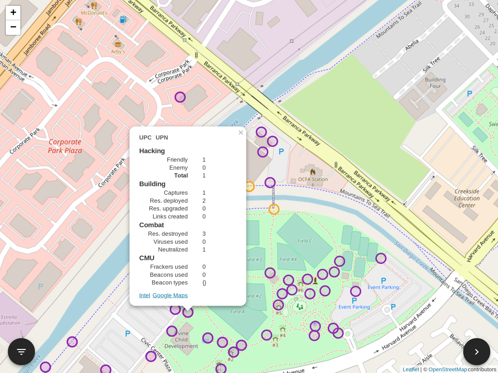

# Explorer

See where Ingress has taken you to, using data provided by Niantic under the new Niantic Privacy Policy.

## Getting started

Once you have obtained the zip file containing your data, extract `game_log.tsv` and import it onto https://explorer.zhaofeng.li.
All processing is done in your browser.

## Building

All you need is Node.js and [Yarn](https://yarnpkg.com/).
Simply run `yarn` then `yarn serve` to fire up the dev server.

## Hacking

Explorer follows the [Airbnb style guide](https://github.com/airbnb/javascript).
Most of the fun things, including the log parser, reside in `src/Explorer`.
Happy hacking! 😘

## Licensing

Explorer is licensed under the BSD 2-Clause License.
See `LICENSE.md` for details.

This project depends on certain third-party packages.
Run `yarn licenses ls` to show their respective licenses.
